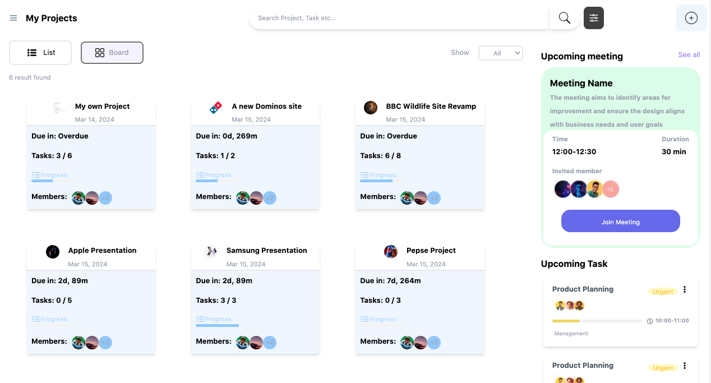
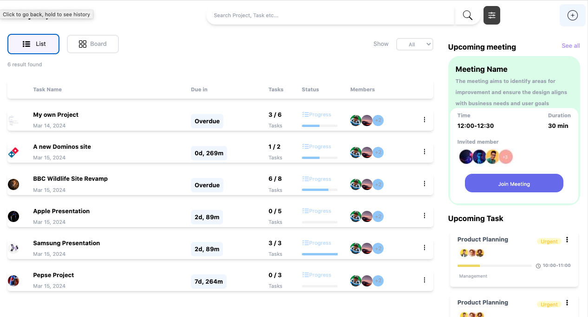
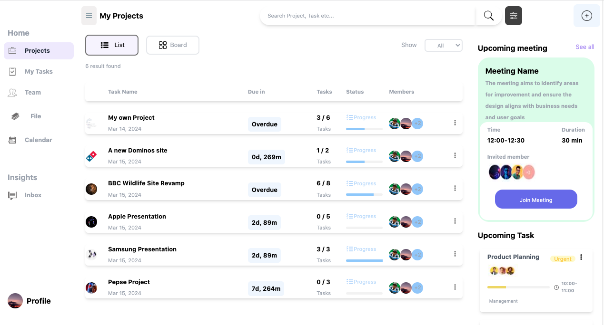
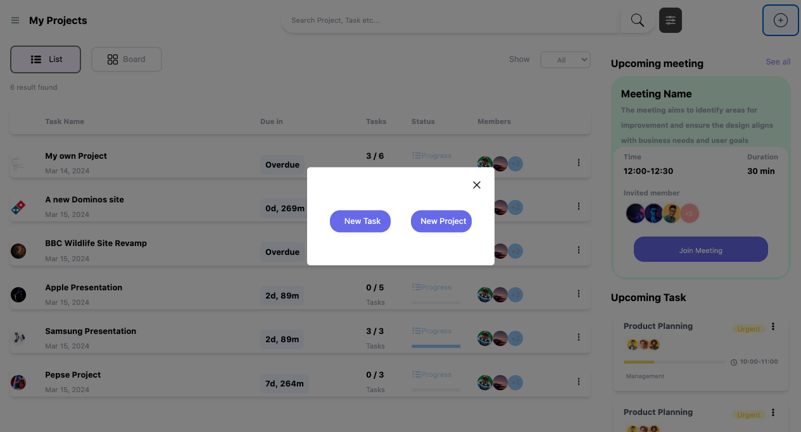
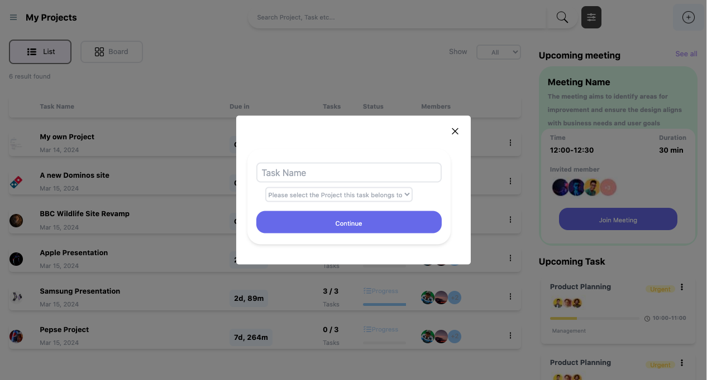

# Project Manager

This is an MVP on a Project Management web application

Its Backend API is built using the Django REST Framework

Currently hosted on [here.](https://myprojectmanagerapi.pythonanywhere.com/api/v1/user)

The Documentation/Guide for the API usage can be found [here.](https://docs.google.com/document/d/1iVsxsomCX8dHYuB_vynoC0H7ida8bcPNMafNYwNtJ3I/edit?usp=sharing)

The front end is built using HTML/CSS and Tailwind CSS, as well as Jquery and Ajax for dynamic content

The UI is currently hosted [here.](https://inspiring-figolla-1d2347.netlify.app)

You can use the credentials to log in and view the basic UI
Username
```
Username
```

Password
```
Password12
```

## The UI










## Demo

You can find the app Demo [here.](https://youtu.be/nBXWYMvkN3M?feature=shared)
This Demo would be updated as the apps functionality is updated
